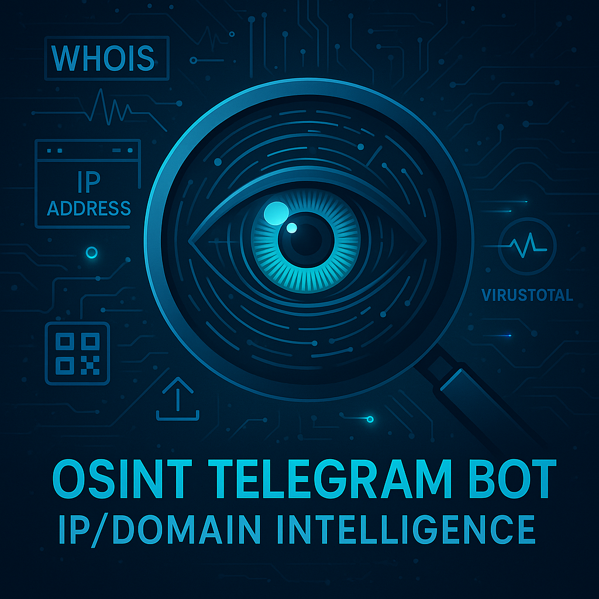

# 🕵️ OSINT Telegram Bot – IP/Domain Intelligence

## 📸 Screenshot


---

##  Overview

This Telegram bot performs **OSINT** (Open Source Intelligence) analysis on IP addresses and domain names.  
It accepts input via text messages, images (OCR), or QR codes, and returns a detailed intelligence report.

---

##  Features

- Supports:
  -  Plain text input (IP address or domain name)  
  -  Images containing IP/domain (via OCR)  
  -  QR codes containing IP or domain  
- Automatically resolves domain names to IP addresses
- Input validation using regular expressions
- Intelligence checks include:
  - WHOIS data lookup  
  - IP geolocation (country, city, ISP)  
  - Port scanning (top 15 TCP/UDP ports using Nmap)  
  - Blacklist status (e.g., VirusTotal, AbuseIPDB)  
  - Wayback Machine Snapshot
- Generates an HTML report and returns it to the user
- Rejects unsupported content types (documents, audio, stickers, etc.)
- Includes error handling for API failures and invalid input

---

##  Supported Input

**Accepted:**
- Valid IPv4 addresses and domain names (as text)
- Images with visible IP/domain (via OCR)
- QR codes with valid IP/domain

**Rejected:**
- Any file type that is not an image
- Invalid or empty text input
- Images/QRs without a valid entity

---

##  Technologies Used

- Python
- [python-telegram-bot](https://github.com/python-telegram-bot/python-telegram-bot) (v20+)
- pytesseract (OCR)
- pyzbar (QR decoding)
- socket, whois, requests
- Nmap (port scanning)-15 most common for speed improvment
- python-dotenv (.env management)
- Docker & Docker Compose
- iframe

---

##  Requirements

To run this project, you need:

- 🐳 Docker & Docker Compose installed  
-  Telegram bot token from **@BotFather**  
-  API keys:
  - [VirusTotal](https://www.virustotal.com/gui/join-us)
  - [AbuseIPDB](https://www.abuseipdb.com/)

---

##  Setup and Execution

### 1. Clone the Repository

```bash
git clone https://github.com/Sagib8/osint-telegram-bot.git
cd osint-telegram-bot
```

### 2. Create a `.env` file

```env
TELEGRAM_TOKEN=your_telegram_bot_token
VT_API_KEY=your_virustotal_api_key
ABUSEIPDB_API_KEY=your_abuseipdb_api_key
```

### 3. Build and Run with Docker Compose

```bash
docker-compose up --build
```

---

##  Getting Your Telegram Token

To create a bot with **@BotFather**:

1. Open Telegram and search for `@BotFather`  
2. Start a chat and send `/newbot`  
3. Follow the prompts:
   - Choose a name (e.g., *OSINT Bot*)
   - Choose a unique username (e.g., *osintbot_xyz*)
4. BotFather will give you a token — copy it
5. Paste the token into your `.env` file under `TELEGRAM_TOKEN`

---

## 📄 Report Output

Each analysis generates an `.html` report including:

- WHOIS registration information
- IP Geolocation (country, city, ISP)
- Open TCP/UDP ports (top 15)
- Blacklist/malicious status (if available)

The report is sent back to the user through Telegram.

---

## 🔒 Security and Best Practices

- API keys are stored securely in a `.env` file
- All errors are handled and logged properly
- Temporary files (images, reports) are deleted after processing

---

##  Bot Commands

- `/start` – Welcome message and instructions  
- `/help` – List of supported inputs and features

---

##  APIs and Tools Used

- WHOIS Lookup  
- IP Geolocation API  
- VirusTotal  
- AbuseIPDB  
- Nmap  
- pytesseract (OCR)  
- pyzbar (QR decoder)

---

## 📜 License

This project is provided **for educational and research purposes only**.
